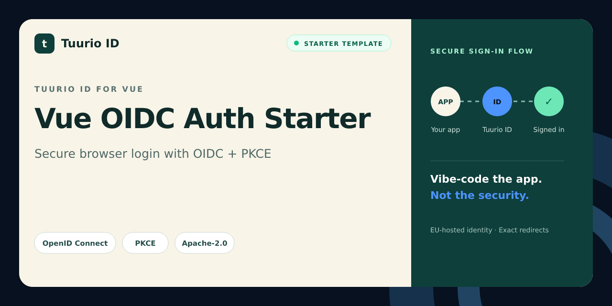

# Vue OIDC Auth Starter

Vue 3 and Vite authentication starter for Tuurio ID with protected routes and OpenID Connect Authorization Code with PKCE.

[](https://github.com/Tuurio/vue-oidc-auth-starter/actions/workflows/verify.yml)



> Generated from [`Tuurio/auth_samples/auth_samples_vue3`](https://github.com/Tuurio/auth_samples/tree/main/auth_samples_vue3). Submit implementation fixes upstream so they are not replaced by the next synchronized release.

## What you get

- Standards-based OpenID Connect authentication with framework-native integration.
- Exact redirect and post-logout redirect handling.
- Protected-route and logout examples.
- A reviewed, pinned Tuurio provisioning workflow.

## Quickstart

1. Create a repository with **Use this template** or clone this repository.
2. Follow the framework-specific prerequisites below.
3. Review and run this pinned provisioning command:

```bash
npx manage-tuurio-id@1.1.6 init --framework vue --project-dir . --auth browser --yes --output json --campaign github_vue --no-open --no-wait
```

4. Approve the exact command, then complete the secure browser handoff yourself.
5. Run the build and verify one real sign-in and sign-out.

Never paste credentials, client secrets, authorization codes, tokens, session cookies, or environment-file contents into an agent chat. Browser and native applications are public clients and must not contain a client secret.

## Runtime and verification

- Runtime: Node.js 20+
- Package manager: npm
- Verification: `npm ci && npm run build`

## Security model

This starter uses OpenID Connect Authorization Code flow. Browser and native clients use PKCE S256 and contain no client secret. Redirect and post-logout redirect URIs must match exactly. Identity comes from the established OIDC integration or an authenticated UserInfo request; decoded JWT payloads are never treated as validation. Keep generated local environment files ignored and never commit tokens or credentials.

## Framework instructions

# Tuurio Auth Vue Demo

A Vue 3 + Vite demo that signs in with OAuth 2.0 / OpenID Connect, then displays token contents and a logout button.

## Integration guide

- Detailed integration guide: [Vue example page](https://id.tuurio.com/public/developers/examples/vue)
- General developer docs: [Tuurio ID developers](https://id.tuurio.com/public/developers)

## Setup

1. Install dependencies:

```bash
npm install
```

2. Create your local config:

```bash
cp .env.example .env
```

3. Update `.env` with your tenant values from:

```text
https://<tenantId>.id.tuurio.com/admin/clients
```

4. Start dev server:

```bash
npm run dev
```

Open `http://localhost:5173`.

## Required client URLs

Configure your Tuurio client with these redirect URLs (matching your `.env` values):

```text
Redirect URI: http://localhost:5173/auth/callback
Post-logout Redirect URI: http://localhost:5173/logout/callback
```

The demo also accepts `/callback` for compatibility.

## `.env` keys

```env
VITE_TUURIO_ISSUER=https://YOUR_TENANT.id.tuurio.com
VITE_TUURIO_CLIENT_ID=YOUR_CLIENT_ID
VITE_TUURIO_REDIRECT_URI=http://localhost:5173/auth/callback
VITE_TUURIO_POST_LOGOUT_REDIRECT_URI=http://localhost:5173/logout/callback
VITE_TUURIO_SCOPE=openid profile email
```

Notes:
- This is a public SPA client. Do not use or commit confidential client secrets.
- Keep redirect URIs and post-logout URIs exact.


## License

Licensed under the Apache License, Version 2.0. See [`LICENSE`](./LICENSE).
